## NFT Basico usando la red de Metis

> [!NOTE]
> Aqui esta la traducción del tutorial de [🚩 Challenge #0: 🎟 Simple NFT Example](docs/challenge-0-simple-nft.md) en 
> español.
>

He modificado un poco el tutorial de [Scaffold ETH](https://github.com/scaffold-eth/se-2-challenges/tree/challenge-0-simple-nft)
para que funcione con la red de **Metis**, mas exactamente **Metis Sepolia**.

Este esta mas simplificado y solo se enfoca en la creación de un contrato NFT básico.
Con lo cual solo debes preocuparte por ejecutar los comandos y seguir los pasos, para que puedas crear tu propio 
contrato NFT en la red de Metis, sin problemas.

> [!NOTE]
> Puedes seguir el tutorial original de
> [Scaffold ETH](https://github.com/scaffold-eth/se-2-challenges/tree/challenge-0-simple-nft) o la version en español
> [🚩 Challenge #0: 🎟 Simple NFT Example](docs/challenge-0-simple-nft.md) para crear un contrato NFT en la red de prueba 
> de Ethereum.
>
 
### Pasos:

**Paso 1**

Clona el repositorio de [Simple NFT Spanish](https://github.com/drzioner/simple-nft-spanish) en tu maquina local.
```bash
    git clone https://github.com/drzioner/simple-nft-spanish.git
```
OR 
```bash
    git clone https://github.com/drzioner/simple-nft-spanish.git el-nombre-que-quieras
```
Luego debes dirigirte a la carpeta del proyecto.
```bash
    cd simple-nft-spanish
```

**Paso 2**

> [!NOTE]
> Antes de comenzar, asegúrate de tener instalado [Node.js](https://nodejs.org/es/) y [Yarn](https://yarnpkg.com/). 
> es muy importante que tu version de Node.js sea igual o mayor de 18.17.0 o inferior a la version 21, esto no se 
> comenta en el tutorial original, pero es importante tenerlo en cuenta.
> 

Instala las dependencias del proyecto, he agragado un archivo `.nvmrc` para que al subirlo a **Vercel** no tengas 
   problemas ocn  la version de **Node.js**.
```bash
    yarn install
```

**Paso 3**

Luego debes ejecutar la cadena de prueba de **Hardhat** en local, esto nos ayuda a validar que todo esta 
   funcionan bien.
```bash
    yarn chain
```
Deberias ver algo como esto:
```bash
Started HTTP and WebSocket JSON-RPC server at http://127.0.0.1:8545/

Accounts
========

WARNING: These accounts, and their private keys, are publicly known.
Any funds sent to them on Mainnet or any other live network WILL BE LOST.

Account #0: 0xf39Fd6e51aad88F6F4ce6aB8827279cffFb92266 (10000 ETH)
Private Key: 0xac0974bec39a17e36ba4a6b4d238ff944bacb478cbed5efcae784d7bf4f2ff80

Account #1: 0x70997970C51812dc3A010C7d01b50e0d17dc79C8 (10000 ETH)
Private Key: 0x59c6995e998f97a5a0044966f0945389dc9e86dae88c7a8412f4603b6b78690d

Account #2: 0x3C44CdDdB6a900fa2b585dd299e03d12FA4293BC (10000 ETH)
Private Key: 0x5de4111afa1a4b94908f83103eb1f1706367c2e68ca870fc3fb9a804cdab365a

Account #3: 0x90F79bf6EB2c4f870365E785982E1f101E93b906 (10000 ETH)
Private Key: 0x7c852118294e51e653712a81e05800f419141751be58f605c371e15141b007a6

Account #4: 0x15d34AAf54267DB7D7c367839AAf71A00a2C6A65 (10000 ETH)
Private Key: 0x47e179ec197488593b187f80a00eb0da91f1b9d0b13f8733639f19c30a34926a

Account #5: 0x9965507D1a55bcC2695C58ba16FB37d819B0A4dc (10000 ETH)
Private Key: 0x8b3a350cf5c34c9194ca85829a2df0ec3153be0318b5e2d3348e872092edffba

Account #6: 0x976EA74026E726554dB657fA54763abd0C3a0aa9 (10000 ETH)
Private Key: 0x92db14e403b83dfe3df233f83dfa3a0d7096f21ca9b0d6d6b8d88b2b4ec1564e

Account #7: 0x14dC79964da2C08b23698B3D3cc7Ca32193d9955 (10000 ETH)
Private Key: 0x4bbbf85ce3377467afe5d46f804f221813b2bb87f24d81f60f1fcdbf7cbf4356

Account #8: 0x23618e81E3f5cdF7f54C3d65f7FBc0aBf5B21E8f (10000 ETH)
Private Key: 0xdbda1821b80551c9d65939329250298aa3472ba22feea921c0cf5d620ea67b97

Account #9: 0xa0Ee7A142d267C1f36714E4a8F75612F20a79720 (10000 ETH)
Private Key: 0x2a871d0798f97d79848a013d4936a73bf4cc922c825d33c1cf7073dff6d409c6

Account #10: 0xBcd4042DE499D14e55001CcbB24a551F3b954096 (10000 ETH)
Private Key: 0xf214f2b2cd398c806f84e317254e0f0b801d0643303237d97a22a48e01628897

Account #11: 0x71bE63f3384f5fb98995898A86B02Fb2426c5788 (10000 ETH)
Private Key: 0x701b615bbdfb9de65240bc28bd21bbc0d996645a3dd57e7b12bc2bdf6f192c82

Account #12: 0xFABB0ac9d68B0B445fB7357272Ff202C5651694a (10000 ETH)
Private Key: 0xa267530f49f8280200edf313ee7af6b827f2a8bce2897751d06a843f644967b1

Account #13: 0x1CBd3b2770909D4e10f157cABC84C7264073C9Ec (10000 ETH)
Private Key: 0x47c99abed3324a2707c28affff1267e45918ec8c3f20b8aa892e8b065d2942dd

Account #14: 0xdF3e18d64BC6A983f673Ab319CCaE4f1a57C7097 (10000 ETH)
Private Key: 0xc526ee95bf44d8fc405a158bb884d9d1238d99f0612e9f33d006bb0789009aaa

Account #15: 0xcd3B766CCDd6AE721141F452C550Ca635964ce71 (10000 ETH)
Private Key: 0x8166f546bab6da521a8369cab06c5d2b9e46670292d85c875ee9ec20e84ffb61

Account #16: 0x2546BcD3c84621e976D8185a91A922aE77ECEc30 (10000 ETH)
Private Key: 0xea6c44ac03bff858b476bba40716402b03e41b8e97e276d1baec7c37d42484a0

Account #17: 0xbDA5747bFD65F08deb54cb465eB87D40e51B197E (10000 ETH)
Private Key: 0x689af8efa8c651a91ad287602527f3af2fe9f6501a7ac4b061667b5a93e037fd

Account #18: 0xdD2FD4581271e230360230F9337D5c0430Bf44C0 (10000 ETH)
Private Key: 0xde9be858da4a475276426320d5e9262ecfc3ba460bfac56360bfa6c4c28b4ee0

Account #19: 0x8626f6940E2eb28930eFb4CeF49B2d1F2C9C1199 (10000 ETH)
Private Key: 0xdf57089febbacf7ba0bc227dafbffa9fc08a93fdc68e1e42411a14efcf23656e

WARNING: These accounts, and their private keys, are publicly known.
Any funds sent to them on Mainnet or any other live network WILL BE LOST.
```
> [!NOTE]
> Si quieres usar alguna de estas cuentas para hacer pruebas, puedes hacerlo, pero recuerda configurar
> la red de Hardhat en tu **Metamask**. Aqui te dejo como hacerlo si no lo recuerdas:
> [Metamask Hardhat](docs/metamask-hardhat.md)
>

Ahora debes desplegar el contrato en la red de **Hardhat**. Esto debes hacerlo en una nueva terminal.
```bash
    yarn deploy --network localhost
```
Deberias ver algo como esto:
```bash
Generating typings for: 18 artifacts in dir: typechain-types for target: ethers-v6
Successfully generated 48 typings!
Compiled 20 Solidity files successfully (evm target: london).
deploying "YourCollectible" (tx: 0x364d576dca178e40400c27745a166360778ada56ce81fbe0b1a9924293fa7210)...: deployed at 0x5FbDB2315678afecb367f032d93F642f64180aa3 with 1758855 gas
📝 Updated TypeScript contract definition file on ../nextjs/contracts/deployedContracts.ts
```

> [!IMPORTANT]
> Recuerda cada que actualices el contrato debes ejecutar este comando para que se actualice el contrato en la red.
> 

**Paso 4**

Ahora debes ejecutar el servidor de **Next.js** para poder ver la aplicación en tu navegador.
```bash
    yarn start
```
Deberias ver algo como esto:
```bash
   ▲ Next.js 14.1.0
   - Local:        http://localhost:3000

 ✓ Ready in 5.3s
 ○ Compiling / ...
Browserslist: caniuse-lite is outdated. Please run:
  npx update-browserslist-db@latest
  Why you should do it regularly: https://github.com/browserslist/update-db#readme

🌼   daisyUI 4.5.0
├─ ✔︎ 2 themes added            https://daisyui.com/docs/themes
╰─ ❤︎ Support daisyUI project:  https://opencollective.com/daisyui
```
Ahora puedes abrir tu navegador y ver la aplicación en la dirección [http://localhost:3000](http://localhost:3000)
   y deberias ver algo como esto:

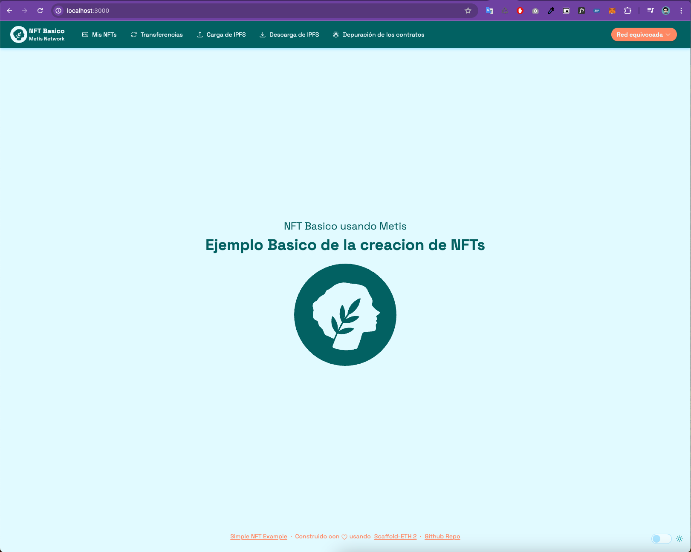

Ahora debemos conectar nuestra App con **Metamask** para poder interactuar con la red de **Metis Sepolia**.
Por ahora en nuestra aplicación debemos que nos indica que estamos en la red equivocada, eso es porque aun no
hemos seleccionado la red de **Metis Sepolia**.

> [!NOTE]
> Si tiene seleccionada la red de **Metis Sepolia** en **Metamask** puedes seguir con el siguiente paso.
>

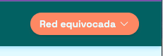

Haz clic en el botón **Red equivocada**. Veras algo como esto:

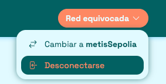

Ahora tu Metamask te deberia mostrar algo como esto:

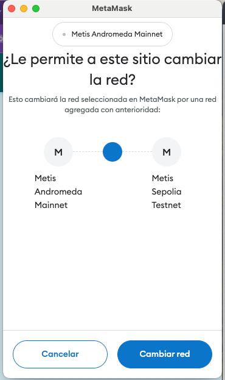

Hacemos clic en **Cambiar red** y listo, ahora estamos conectados a la red de **Metis Sepolia**.
Ahora deberias ver algo como esto:

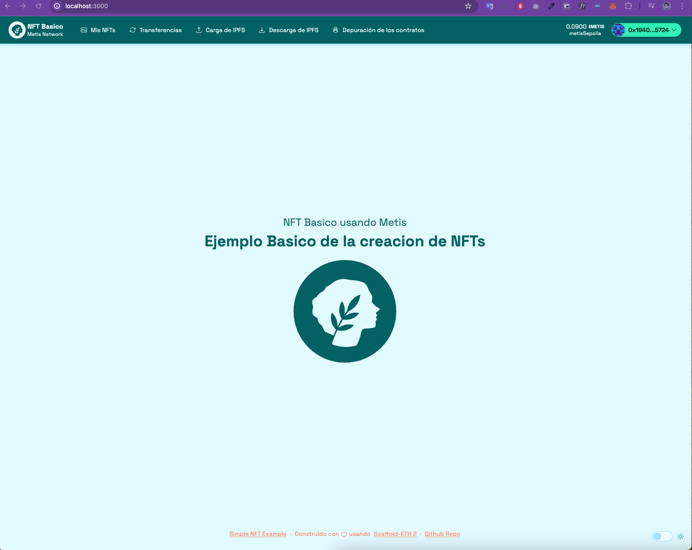

**Paso 5**

Ahora debemos generar una nueva cuenta en **Metamask** para poder interactuar con la red de **Metis Sepolia**. Es 
   una buena practica hacer esto ahora vamos a ejecutar el siguiente comando:
```bash
    yarn generate
```
Deberias ver algo como esto:
```bash
👛 Generating new Wallet
📄 Private Key saved to packages/hardhat/.env file
🪄 Generated wallet address: 0x577a91F64A2f1F1d571F3e0DF28FA9f8F26Fde43
```
ahora dirijete a este directorio `packages/hardhat` deberias encontrar un nuevo archivo `.env` con tu clave privada.
```dotenv
    DEPLOYER_PRIVATE_KEY=0x66cebd6204dc45923a2f30a75b32872d2i76123756127561257612837512875
```
Esa clave privada es la que debes agregar a tu **Metamask** para poder interactuar con la red de **Metis Sepolia**.

Ahora debes configurar tu **Metamask** para que puedas interactuar con la red de **Metis Sepolia**. Aqui te dejo 
   como hacerlo: [Metamask Metis](docs/metamask-metis.md)

> [!WARNING]
> Recuerda que debes tener tMetis o Metis de prueba para poder interactuar con la red de Metis Sepolia.
> Aqui te dejo como obtener Metis de prueba: [Metis Faucet](docs/metis-faucet.md)
>

**Paso 6**

Ahora vamos a ejecutar el siguiente comando para desplegar el contrato en la red de **Metis Sepolia**.

> [!WARNING]
> Recuerda que debes tener tMetis o Metis de prueba para poder desplegar el contrato en la red de Metis Sepolia.
> Aqui te dejo como obtener Metis de prueba: [Metis Faucet](docs/metis-faucet.md)
>

```bash
    yarn deploy
```
Deberias ver algo como esto:
```bash
Nothing to compile
No need to generate any newer typings.
deploying "YourCollectible" (tx: 0xbce7a632fa60a48a7ba903d925eefc5d99eba716b9f253f6b26db4gd8gd9)...: deployed at 
0x6Da505acA21f5E262E099eB5048D3df87d98g9d with 1758345 gas
📝 Updated TypeScript contract definition file on ../nextjs/contracts/deployedContracts.ts
```

**Paso 7**

Ahora puedes interactuar con la aplicación y crear tu propio contrato NFT en la red de **Metis Sepolia**.

> [!WARNING]
> La red de Metis Sepolia no viene preconfigurada en Viem, por lo que tuve que crear una red de prueba personalizada.
> Aqui te dejo la configuracion de la red de Metis Sepolia para que puedas agregarla a tu proyecto:
> `packages/nextjs/metis-sepolia-chain-config.ts`, ademas te dejo la documentación oficial de
> [Metis](https://docs.metis.io/dev/readme/connection-details) y
> [Viem](https://viem.sh/docs/chains/introduction#custom-chains) por si quieres mas información.
> 

Ahora dirige a tu navegador y ve a la dirección [http://localhost:3000/my-nfts](http://localhost:3000/my-nfts) y deberias ver algo
    como esto:

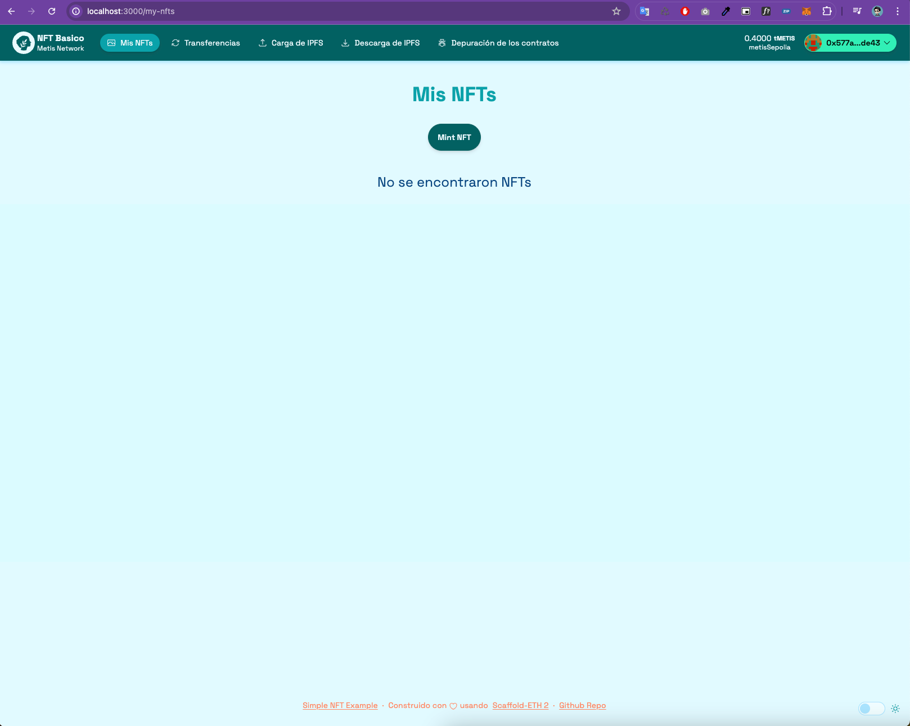
 pulsa el botón **Mint NFT** y deberias ver algo como esto:

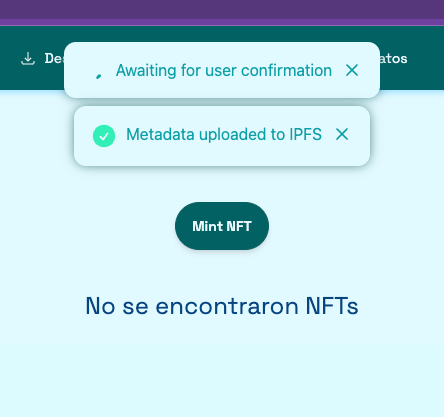

eso desplegara tu MetaMask y deberias ver algo como esto:

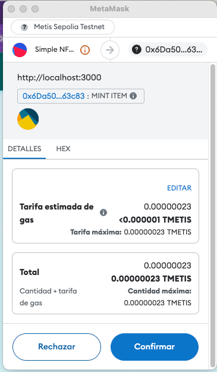

debes aprobar la transacción y listo, ahora deberias ver algo como esto:

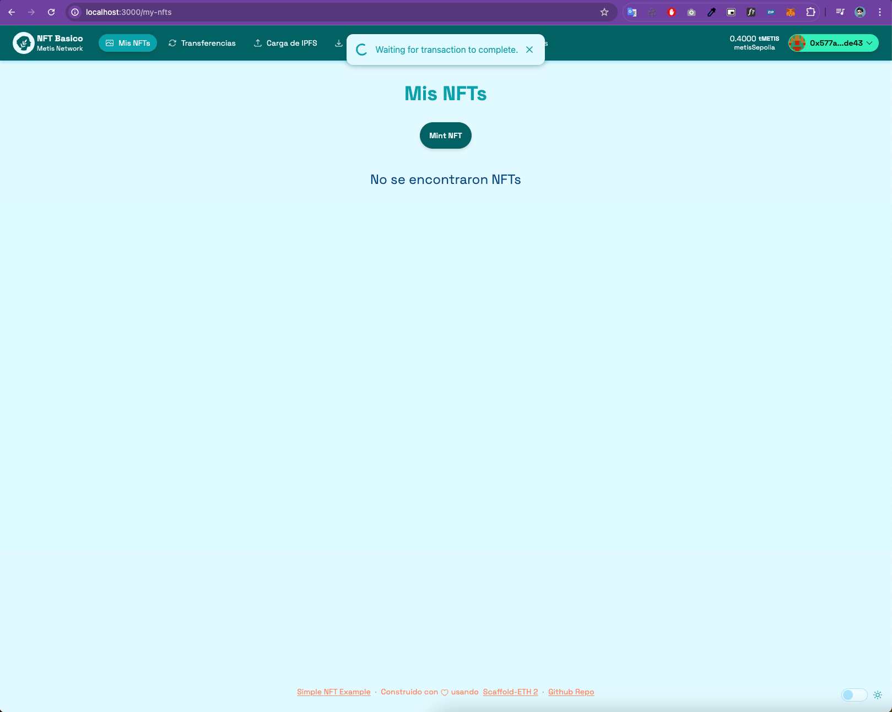

espera unos segundos y deberias ver tu primer NFT en la lista, algo como esto:

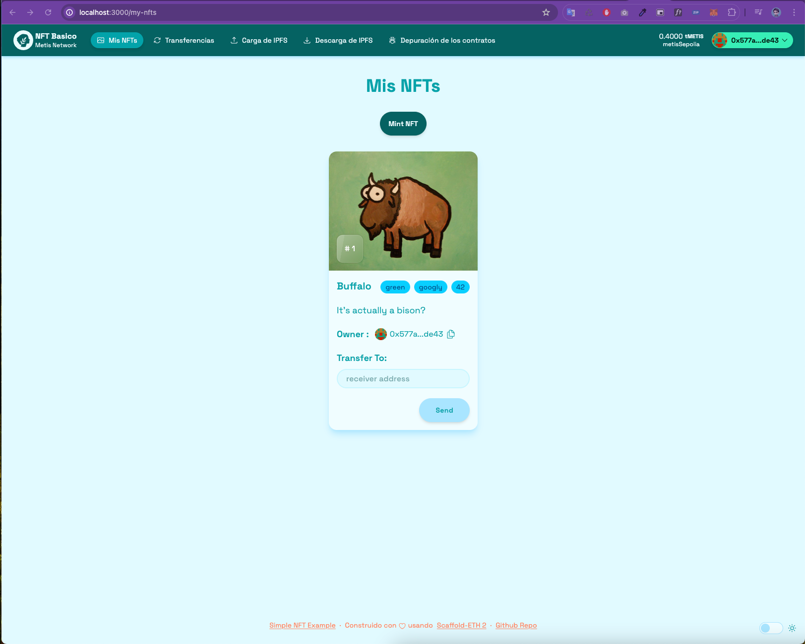

Ya puedes interactuar con tu NFT y ver los detalles del mismo.


**Paso 8**

Por ultimo vamos a desplegar nuestra aplicación en **Vercel** para que puedas compartirla con tus amigos.

> [!NOTE]
> Si no tienes una cuenta en **Vercel** puedes crear una en [Vercel](https://vercel.com/)
> 

Vamos a ejecutar el siguiente comando para desplegar nuestra aplicación en **Vercel**.
```bash
    yarn vercel
```

Deberias ver algo como esto:
```bash
Vercel CLI 32.7.2
? Set up and deploy "~/your-user/your-directory/simple-nft-spanish/packages/nextjs"? [Y/n] y
? Which scope do you want to deploy to? Your personal account
? Link to existing project? [y/N] n
? What’s your project’s name? simple-nft-spanish
? In which directory is your code located? ./
Local settings detected in vercel.json:
- Install Command: yarn install
Auto-detected Project Settings (Next.js):
- Build Command: next build
- Development Command: next dev --port $PORT
- Output Directory: Next.js default
? Want to modify these settings? [y/N] n
🔗  Linked to <your-project-account>/simple-nft-spanish (created .vercel)
🔍  Inspect: https://vercel.com/<your-project-account>/simple-nft-spanish/4RZHEToHsQZM4zeuyxLBsU1gVW1g [2s]
✅  Preview: https://simple-nft-spanish-hmf58oq5x-<your-project-account>.vercel.app [2s]
⠸ Building
```

al final deberias ver algo como esto:

```bash
📝  Deployed to production. Run `vercel --prod` to overwrite later (https://vercel.link/2F).
💡  To change the domain or build command, go to https://vercel.com/<your-project-account>/simple-nft-spanish/settings
```

Ve a tu cuenta de **Vercel** y deberias ver algo como esto:

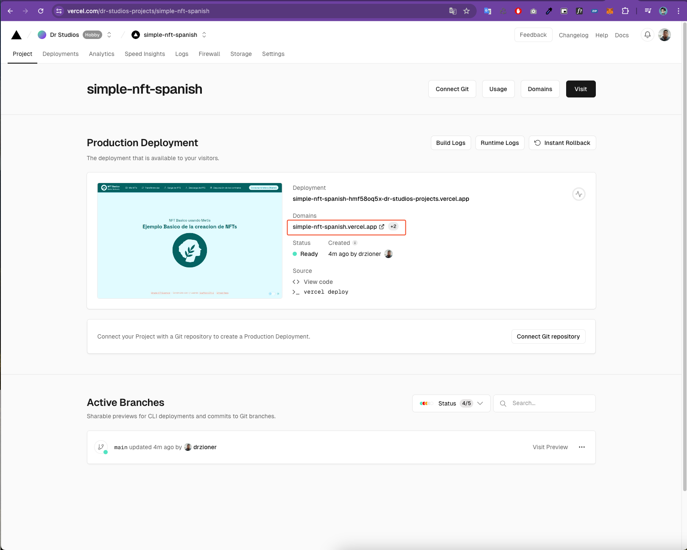

El enlace marcado en la imagen anterior es el enlace de tu aplicación desplegada en **Vercel**.
en mi caso es [Simple NFT Spanish](https://simple-nft-spanish.vercel.app/)

Ahora puedes compartir tu aplicación con tus amigos y familiares.
