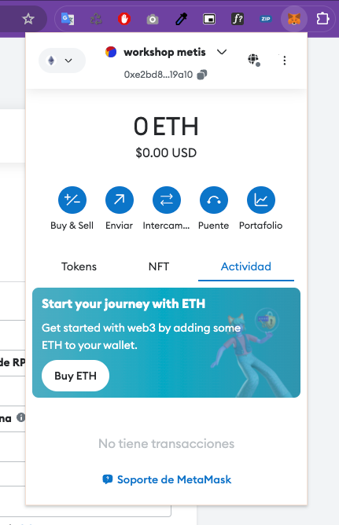
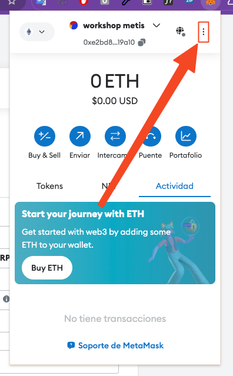
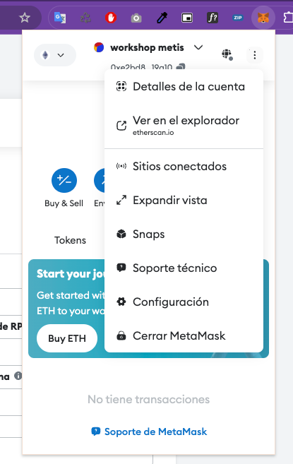
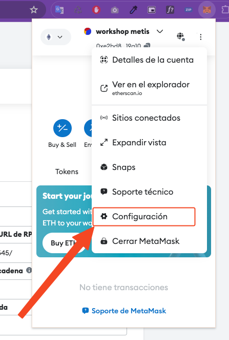
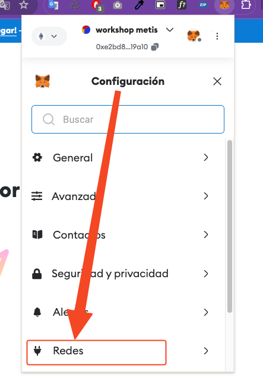
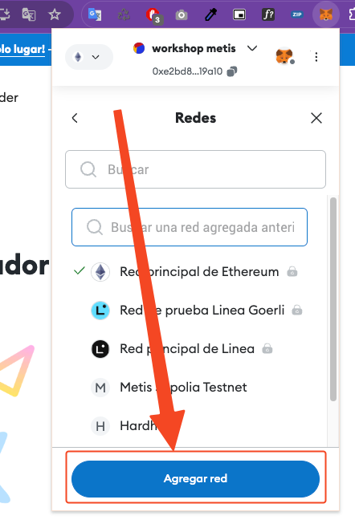
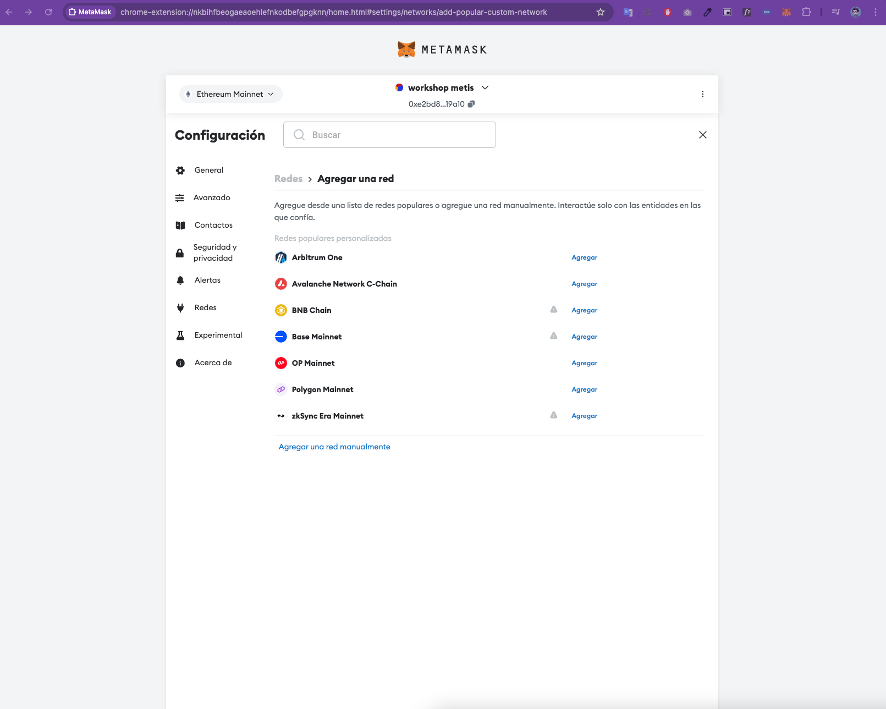
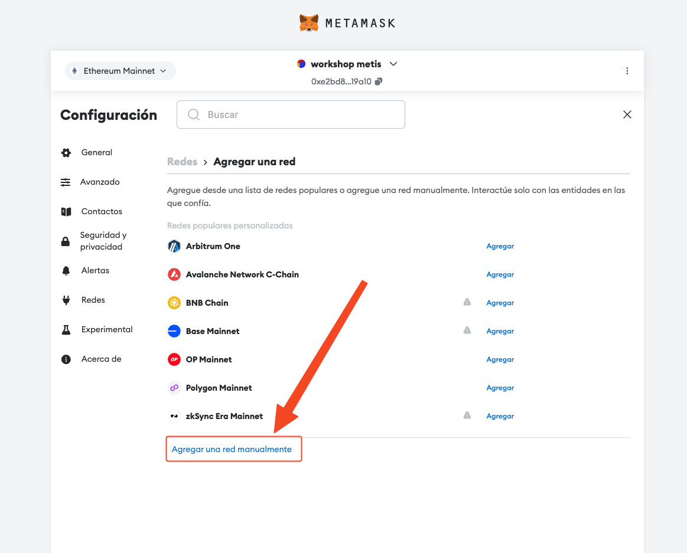
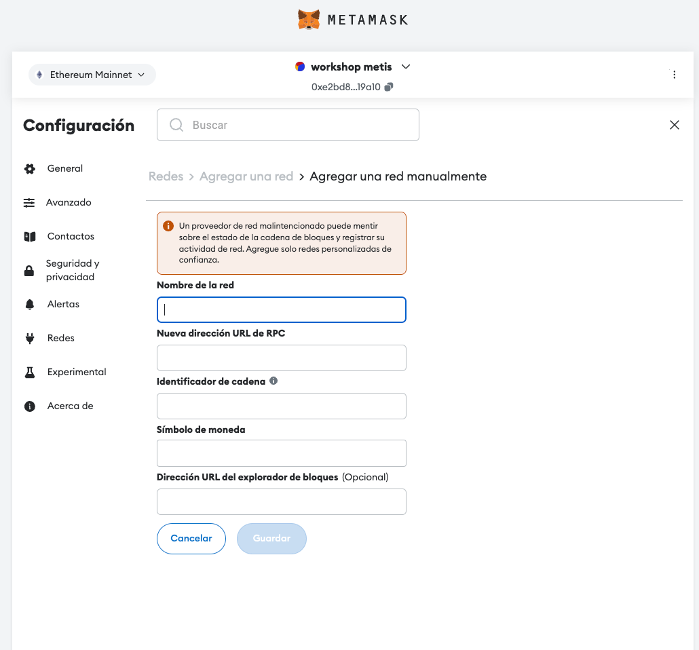
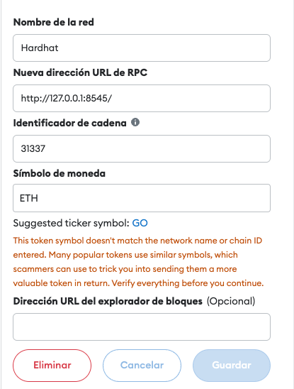

## Configuración de Metamask con Hardhat Local

Para poder interactuar con nuestra red local de Hardhat,
necesitamos configurar Metamask para que se conecte a nuestra red local.

### Paso 1: Tener un instalado Metamask en tu navegador y configurado
Dirigete a la página oficial de [Metamask](https://metamask.io/es/download/) y sigue las instrucciones para instalarlo en tu navegador.

### Paso 2: Configurar Hardhat Network en Metamask
Ahora que tienes Metamask instalado, necesitas configurarlo para que se conecte a nuestra red local de Hardhat.
Para ello debes hacer click en la extension de MetaMask y veras algo similar a la siguiente imagen:

Ahora debes hacer click en los 3 puntos que se encuentran en la parte superior derecha de la ventana de Metamask  
como se muestra en la imagen:

Se expandira un menu y debes hacer click en la opcion `Configuracion` como se muestra en la imagen:

Ahora debes hacer click en la opcion `Redes` como se muestra en la imagen:

Ahora debes hacer click en la opcion `Agregar red` como se muestra en la imagen:

Se va a desplegar una nueva pestaña como se muestra en la imagen:

Ahora da click en la opcion `Agregar una red manualmente` como se muestra en la imagen:

Veras un formulario como el siguiente:

Ahora debes llenar el formulario con los siguientes datos:
- **Nombre de la red**: `Hardhat`
- **Nueva dirección URL de RPC**: `http://127.0.0.1:8545/`
- **Identificador de cadena**: `31337`
- **Símbolo de moneda**: `ETH`

Por último, da click en el boton `Guardar` y listo, ahora Metamask esta configurado para conectarse a tu red local de Hardhat.

> [!NOTE]
> Recuerda que debes tener tu red local de Hardhat ejecutandose para que Metamask pueda conectarse a ella.
> 