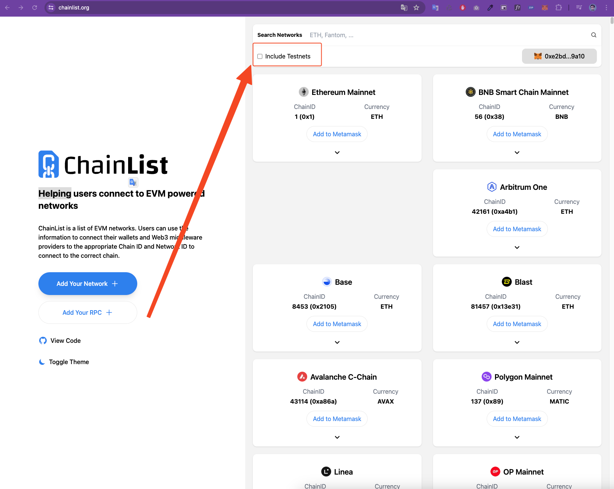
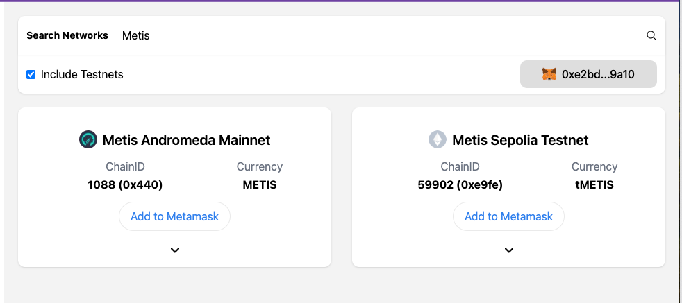
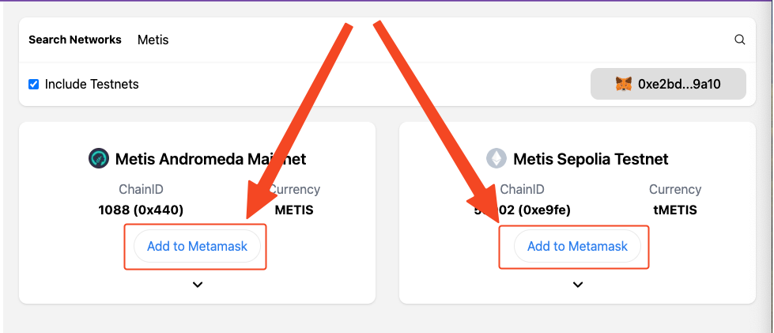

## Configuración de Metis en MetaMask

La configuracion es mas sencilla de lo que parece, solo debes ingresar en [Chainlist](https://chainlist.org/), debes 
asegurarte de seleccionar que se incluyan las redes de prueba.

Debes ahora buscar `Metis` en el buscador, y deberrias ver 2 redes, una es la red de prueba de Metis Sepolia y la 
otra es Metis Andromeda.

Ahora pulsa en `Add to MetaMask`, ahora se te desplegara la extension de Metamask, pidiento confirmacion para 
agregar a nueva red.

Listo, ya tienes configuradas las redes de Metis en tu MetaMask.
