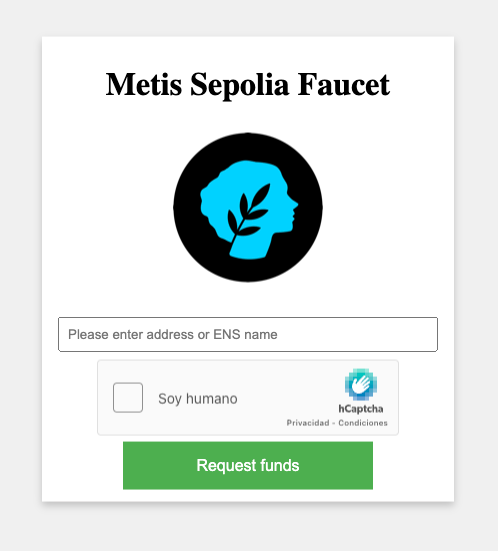
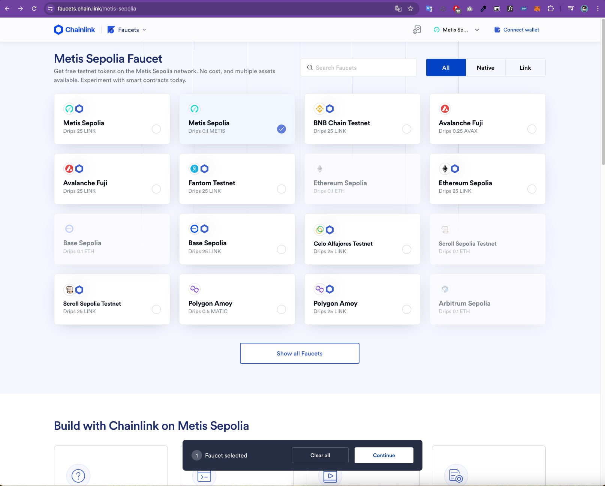
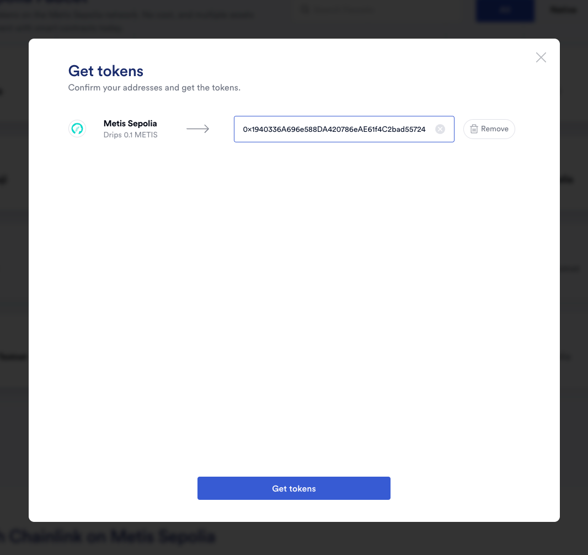

## Metis Faucet
Para poder interactuar con la red de Metis Sepolia necesitas tener Metis de prueba (tMetis), para eso puedes obtener 
Metis de prueba en los siguientes enlaces: 

- [Metis Faucet](https://faucet.metis.io/)

Alli debes ingresar tu dirección de Metamas, aprobar el captcha y hacer click en el boton **Request founds**, deberias 
recibir Metis de prueba en tu cuenta en un rato.

- [Chainlink Metis Faucet](https://faucets.chain.link/metis-sepolia)

En este enlace debes conectar tu cuenta de GitHub, seleccionas **Metis Sepolia**, luego das click en el boton 
**Continue** en la parte inferior

Luego se te abre un modal debes colocar tu dirección de Metamask y hacer click en el boton **Get tokens** y deberias 
tener tus Metis de prueba en tu cuenta en un rato.

